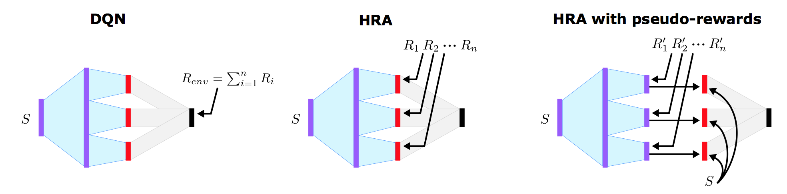

# Hybrid Reward Architecture in PyTorch

As part of the implementation series of [Joseph Lim's group at USC](http://csail.mit.edu/~lim), our motivation is to accelerate (or sometimes delay) research in the AI community by promoting open-source projects. To this end, we implement state-of-the-art research papers, and publicly share them with concise reports. Please visit our [group github site](https://github.com/gitlimlab) for other projects.

This project is implemented by [Te-Lin Wu](https://github.com/telin0411) and the codes have been reviewed by [Youngwoon Lee](https://github.com/youngwoon) before being published.

## Descriptions
This project is a [PyTorch](http://pytorch.org) implementation of [Hybrid Reward Architecture](https://arxiv.org/abs/1706.04208) which was published as a conference proceeding at NIPS 2017. This paper aims to tackle the challenge that obtaining optimal value function as a low-dimensional representation can be hard and unstable, by decomposing the reward function and learn an associated value function to each of them. The dependencies of the features are now reduced, and the optimal value functions can be approximated better. The architecture can also leverage pseudo-reward, which can be any feature-based signals to add more information during training. The paper trained both standard reinforcement learning and deep q-network versions, and tried different variants of adding or removing certain irrelevant features, denoted as hra+1 or dqn+1.

The architecture is as shown below.
<p align="center">
    
</p>

The DQN version of the architecture and the pseudo-rewards
<p align="center">
    
</p>


Note that this implementation may differ in details from the original paper such as model architectures, hyperparameters, applied optimizer, etc. while maintaining the main proposed idea.

Code modified for PyTorch from the original repo [hra](https://github.com/Maluuba/hra)

\*This code is still being developed and subject to change.

## Prerequisites

- Python 2.7
- [PyTorch](http://pytorch.org)
- [SciPy](http://www.scipy.org/install.html)
- [NumPy](http://www.numpy.org/)
- pygame 1.9.2+ (pip install pygame)
- click (pip install click)

## Usage
In the config.yaml, specify the hyper parameters
You can use --mode to change from dgn, dgn+1, hra, and hra+1
The outputs will be saved in the ./results folder as default.

### Train the models
Simple run the following command
```bash
python train.py
```

## Author

Te-Lin Wu / [@telin0411](https://github.com/telin0411) @ [Joseph Lim's research lab](https://github.com/gitlimlab) @ USC
